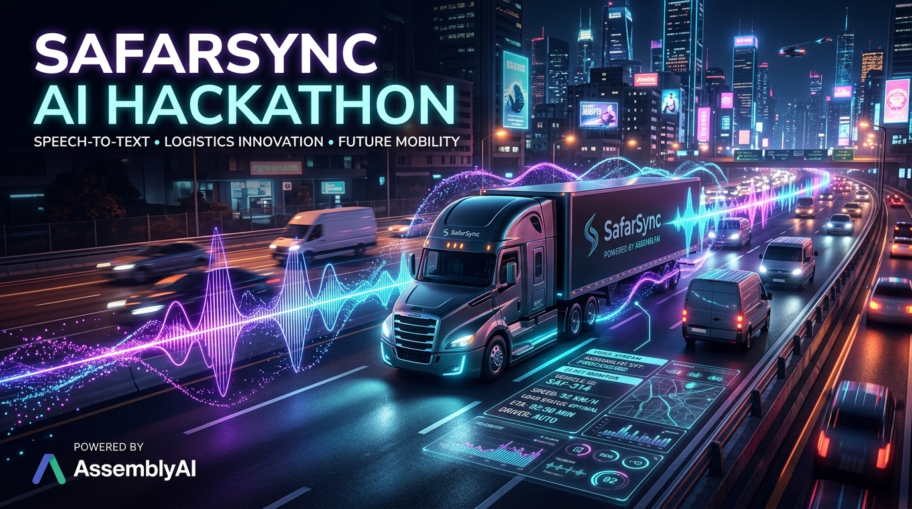

<div align="center">
  

  # SafarSync AI 🚛🎙️
  
  **The ultimate voice-first fleet management platform powered by AssemblyAI.**
  
  [](https://lablab.ai/ai-hackathons/assemblyai-voice-agent-hackathon)
  [](#)
  [](#)
  [](#)
</div>

<br />

## 📖 Overview

**SafarSync AI** is a production-grade, voice-first fleet management software built to bridge the gap between Voice AI and structured business data. It was built explicitly for the **AssemblyAI Voice Agent Hackathon**.

By fusing AssemblyAI’s highly accurate transcription with intelligent schema extraction (via Google Gemini), SafarSync instantly turns messy human speech—like *"I filled up the truck with 10k worth of diesel"*—into perfectly structured, mathematically valid dashboard metrics without a single keystroke.

Transforming how small-to-medium businesses and independent owner-operators track, manage, and optimize their fleets through the power of intelligent voice technology.

---

## 🎯 The Problem We Solve

Traditional fleet management software relies heavily on manual data entry.
- 🚨 **Distracted Driving:** Fleet operators and delivery drivers manually typing logs on their phones while driving poses severe safety risks.
- 🗂️ **Data Fragmentation:** Maintenance, fuel receipts, and mileage are scattered across paper logbooks, WhatsApp groups, and Excel sheets.
- 📉 **Delayed Analytics:** Fleet managers lack real-time visibility into cost per km and fuel efficiency, leading to operational inefficiencies.

---

## 💡 The Solution

SafarSync eliminates manual data entry by introducing a 100% voice-driven pipeline:
- ✅ **Voice-First Logging:** Drivers simply speak into their device. The app handles the rest.
- ✅ **Intelligent Extraction:** Automatic categorization, date tagging, and metric extraction using advanced AI pipelines.
- ✅ **Real-time Telemetry:** Instant analytics on fleet health, operational costs, and automated predictive maintenance alerts.

---

## ⚙️ Application of Technology (The AI Stack)

This platform relies on a dual-agent AI architecture to ensure fast, deterministic, and accurate data logging:

1. **AssemblyAI Universal-3 (The Ears):** 
   Acts as the core voice agent layer. It captures live streaming audio from drivers in noisy environments (highway driving, truck cabins) and provides near-instantaneous, highly accurate speech-to-text transcriptions.
   
2. **Gemini 1.5 Flash Reasoning (The Brain):**
   Takes the raw AssemblyAI transcript and performs structured schema extraction. It identifies context (which vehicle?), categories (Fuel vs. Maintenance), and quantitative amounts, mapping conversational nuance into structured SQL-ready JSON data.

---

## ✨ Key Features

- **Live Voice Logging:** A beautiful, responsive UI that pulses with a real-time waveform while the user speaks.
- **Robust SQLite-Style Logbook:** A highly structured tabular logbook supporting full-text search across vehicles, categories, locations, dates, and notes.
- **Fleet Analytics Dashboard:** Real-time data visualization (built with Recharts) showcasing fuel efficiency (km/L), cost per km, and journey timelines.
- **Data Persistence & Resilience:** Built-in safeguards against data corruption, negative integer injections, and timezone shifts, ensuring enterprise-grade reliability.
- **Cross-Platform PWA:** Accessible on web, mobile, and tablet with seamless cross-navigation.

---

## 🚀 Getting Started

### Prerequisites
- Node.js (v18+)
- AssemblyAI API Key
- Google Gemini API Key

### Installation

1. **Clone the repository:**
   ```bash
   git clone https://github.com/your-username/safarsync-ai.git
   cd safarsync-ai
   ```

2. **Install dependencies:**
   ```bash
   npm install
   ```

3. **Set up Environment Variables:**
   Create a `.env` file in the root directory and add your keys:
   ```env
   VITE_ASSEMBLYAI_API_KEY=your_assemblyai_key_here
   GEMINI_API_KEY=your_gemini_key_here
   ```

4. **Run the Development Server:**
   ```bash
   npm run dev
   ```
   The application will be available at `http://localhost:3000`.

---

## 🏆 Hackathon Context

SafarSync AI was designed specifically to excel in the **lablab.ai AssemblyAI Voice Agent Hackathon**. It directly addresses the core judging criteria by:
- Offering a **flawless presentation and live prototype**.
- Targeting a **massive underserved TAM** (small fleet owner-operators).
- Relying entirely on **AssemblyAI as the central pillar** of the application.
- Showcasing high **originality** by using Voice AI for deterministic data entry and database management, rather than simple conversational chat.

---

<div align="center">
  <p>Built with ❤️ for the AssemblyAI Hackathon.</p>
</div>
